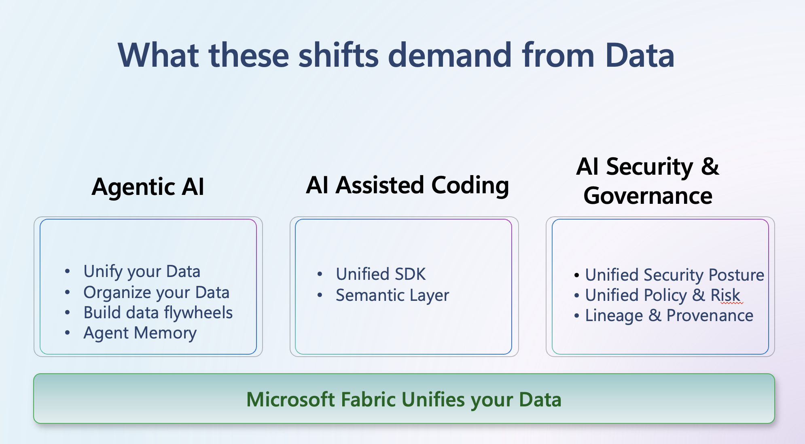

### Agentic AI

- Unify your Data
- Organize your Data
- Build data flywheels
- Agent Memory

### AI Assisted Coding

- Unified SDK
- Semantic Layer

### AI Security & Governance

- Unified Security Posture
- Unified Policy & Risk
- Lineage & Provenance

Microsoft Fabric Unifies your Data
