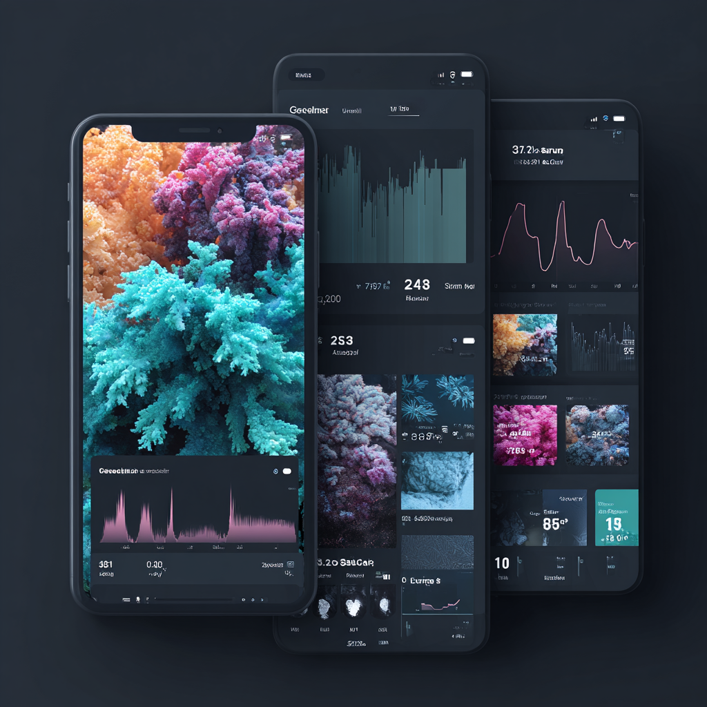

 

### Generative UI — why now

Frictionless UX drives usage. Generative UI reduces friction by assembling interfaces at runtime.

{ style="max-width: 500px; width: 100%; display: block; margin: 1.5em auto; border-radius: 8px; box-shadow: 0 4px 6px rgba(0,0,0,0.1);" }

Adaptive interfaces that respond to context and user signals

Generative UI: interfaces whose structure and behavior are generated on‑the‑fly by models, not hard‑coded. Principles:

- **Dynamic assembly**: Models + analytics compose components in real time per user, device, and goal.
- **Prompt → UI spec**: Intent becomes a typed JSON/declarative spec rendered by a client SDK (e.g., React).
- **Outcome‑oriented personalization**: Designers set goals and constraints; the system adapts using user signals (preferences, behavior, environment).

Types: static (fill parameters), declarative (assemble from a registry), fully generated (raw HTML/CSS). Declarative best balances flexibility and reliability.
Research flags trust, cognitive load, and fairness risks. Add constraints and a11y guardrails. Personalization can also improve readability (e.g., font/spacing per Readability Matters).

Brief: shift from interface-first to outcome-first. Define capabilities, allowlists, and must/should/never rules per individual. Personas and journeys become dynamic; invest in research, testing, and evaluation. We design outcomes and parameters—the system renders the right interface for the moment.
 
 ### Contracts before intelligence
 - **UI schema (DSL)**: typed JSON/YAML describing pages, layouts, components, bindings. Treat as the API between generators and renderers.
 - **Design system primitives**: tokens, layout primitives, and a stable component library with clear props and accessibility guarantees.
 - **Capability map**: what the app can do (search, create, export). Compose only from capabilities; never invent them.
 - **Policy & safety**: allowlists, prop constraints, data access scopes, redaction, and rate limits. Reject or sanitize invalid schemas.
 - **Observability**: structured logs of inputs, chosen variants, user events, and outcomes to drive evaluation.

### Proven patterns
 - **Server-driven UI (schema-first)**: Backend returns a UI schema; client renders. Deterministic and debuggable.
 - **Slot filling**: Model fills copy, labels, hints, or validation messages within an approved layout.
 - **Mixed-initiative flows**: Assistant proposes; user approves/edits/rejects—no silent changes.

### Context signals for adaptation
Front-end-only _mini-CDP_ signals the UI can use:

- **Behavioral events**: page/screen views, clicks on nav items, dwell time, scroll depth, search terms, feature usage (e.g., "FX opened", "BillPay started").
- **Derived traits**: "likes FX", "frequent transfers", "explores offers", "prefers dark mode", "prefers TR locale".
- **Recency/frequency**: last 5 visited menu paths, top 3 actions, last seen balances section.
- **Explicit preferences** (if the user opts in): favorite quick actions, compact vs. comfy layout.

### Quick-win demos (client-side only)
All achievable purely client-side with consent + first-party storage and no user identity:

1. **Remembered navigation** – If the user browsed deep into Payments → Utilities, next visit shows "Pay Bill" first and collapses rarely used categories.
2. **Actionable insights** – Promote "Transfer" and "FX" tiles if used frequently; demote others. Recently used beneficiaries appear inline (stored locally as hashes/aliases, not PII).
3. **Contextual nudges** – If the user lingers on "Services," surface a "Set up Auto‑Save" card next visit. If they ignore a banner 3 times, suppress it for 30 days (local streak counter).
4. **Reading mode preference** – Toggle compact vs. comfy density based on past toggles + dwell time; remember dark mode.
5. **Search intelligence** – If they searched "exchange rates" twice in a week, pre‑expand the FX widget on load.
6. **Micro‑journeys without identity** – User taps "Pay Bill," backs out; show a "Continue Bill Pay?" entry point next visit (timer‑gated, local only).
7. **Language/locale nudges** – If locale is TR and consistently used, keep it sticky and prioritize TR‑first copygen banners.
8. **Quick‑action reordering** – Automatically reorder top 4 quick actions based on frequency + recency.

> Mirrors the behavioral part of Insider (events → segments → experiences), but not the cross‑channel/CDP pieces (email, push, journeys), which need a backend.

### Guardrails and UX quality
Quality guardrails keep generation safe and consistent.
- **Determinism boundaries**: Models may select from allowlisted components and props—never raw code or untyped HTML.
- **A11y by default**: Components must remain accessible regardless of who (human/model) chooses them; enforce roles, labels, focus order.
- **Latency budgets**: Cache schemas, stream renderable chunks, precompute common variants; degrade gracefully when models are slow/offline.
- **Consistency & theming**: Only generate within tokenized design primitives; treat tokens as hard constraints, not suggestions.
- **Data hygiene**: Validate bindings, throttle queries, and sanitize outputs; never let models emit executable code or unsafe URLs.

### Engineering checklist
 - **Define the DSL**: Types, versioning, validation (JSON Schema + runtime checks).
 - **Build the renderer**: Deterministic schema → component mapping; exhaustive prop validation and safe defaults.
 - **Write policy**: Allowlists, prop ranges, PII controls, auth scopes; reject on breach with actionable errors.
 - **Offline-first**: Cached templates and non-model fallbacks; never block critical paths on generation.
 - **Evaluation harness**: Golden tasks, screenshot diffs, a11y tests, latency/error SLOs, canary rollouts.
 - **Telemetry & feedback**: Capture edits/aborts, success metrics, and model rationales to improve selection over time.

- [GenAIUI Whitepaper (2024)](https://6082761.fs1.hubspotusercontent-na1.net/hubfs/6082761/2024%20Whitepaper/GenAIUI%20Whitepaper%202024.pdf)

 
