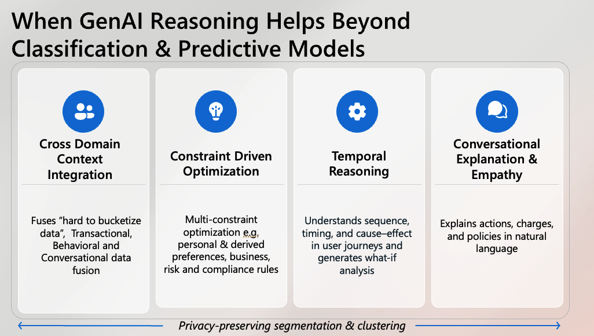

Modern teams often default to “on‑prem LLM with full PII context.” That approach maximizes raw detail but increases privacy exposure, friction, and cost—while rarely improving real decision quality. A more effective pattern is to compress user and business context into privacy‑preserving representations, then apply a reasoning model that can integrate signals, optimize under constraints, and explain outcomes.

### Why compressed context wins

- **Cross‑domain context integration**  
  Fuse transactional, behavioral, conversational, and content signals into compact features: cohort/segment IDs, derived intents, stability metrics, trust scores, eligibility flags. These abstractions travel safely and are easier to audit than raw PII.

- **Constraint‑driven optimization**  
  Real systems are multi‑objective: user utility, cost, risk, compliance, SLAs. Reasoning models can weigh trade‑offs explicitly (e.g., preference satisfaction vs. risk budget) and produce actions that satisfy hard constraints while maximizing soft ones.

- **Temporal reasoning**  
  Sequences matter. Compressed features (event cadence, recency, dwell change, churn risk, lifecycle stage) let the model reason about what‑if outcomes and next best actions without exposing raw timelines or identifiers.

- **Conversational explanation & empathy**  
  Explanations reference segments, policies, and constraints rather than PII fields. Users hear why an action happened in plain language; auditors see policy‑aligned traces.

### Compressed context vs PII‑heavy on‑prem LLMs

- **Privacy & governance**: Move from raw fields to derived traits; minimize data-in-motion and storage of sensitive attributes.
- **Generalization**: Reason over stable abstractions (segments, intents) instead of idiosyncratic identifiers; reduces overfitting to personal detail.
- **Latency & cost**: Smaller prompts and fewer redaction passes; easier caching because features are normalized.
- **Robustness**: Feature drift is measurable; policies encode constraints explicitly; outputs are reproducible.

### What to compress

- Segments and cohorts (behavioral, value‑based, risk, lifecycle)
- Derived preferences (format, channel, tone), intents, and tasks
- Policy/eligibility flags and risk tiers
- Constraint budgets (cost, latency, compliance, fairness thresholds)
- Temporal features (recency, frequency, stability, trend, seasonality)

### When to use each approach

- Use **compressed‑context reasoning** when you need cross‑domain fusion, policy compliance, explainability, and scale under strict privacy constraints.
- Use **PII‑rich on‑prem LLMs** only when raw identifiers materially change outcomes and you have strong legal basis, storage controls, and audit coverage.

### Implementation sketch

1. Build a privacy‑preserving feature layer: segmentation, trait extraction, eligibility rules, constraint budgets. 
2. Define explicit policies and hard/soft constraints; expose them to the model as structured inputs. 
3. Use a reasoning‑capable model (small local or hosted) to generate actions and natural‑language rationales. 
4. Log features + constraints + decisions (no raw PII) for replay, audits, and A/Bs. 
5. Monitor drift in features and policies; retrain segmentation and trait extractors on schedule.

> TL;DR: Compress context into safe, auditable features and let the model reason under constraints. You gain privacy, robustness, and better decisions—without hauling raw PII into every prompt.
