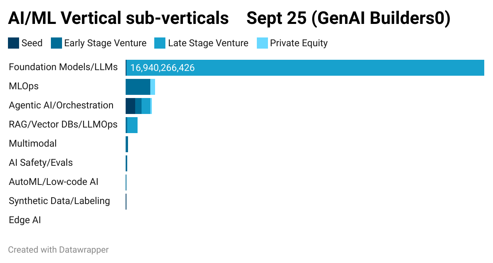
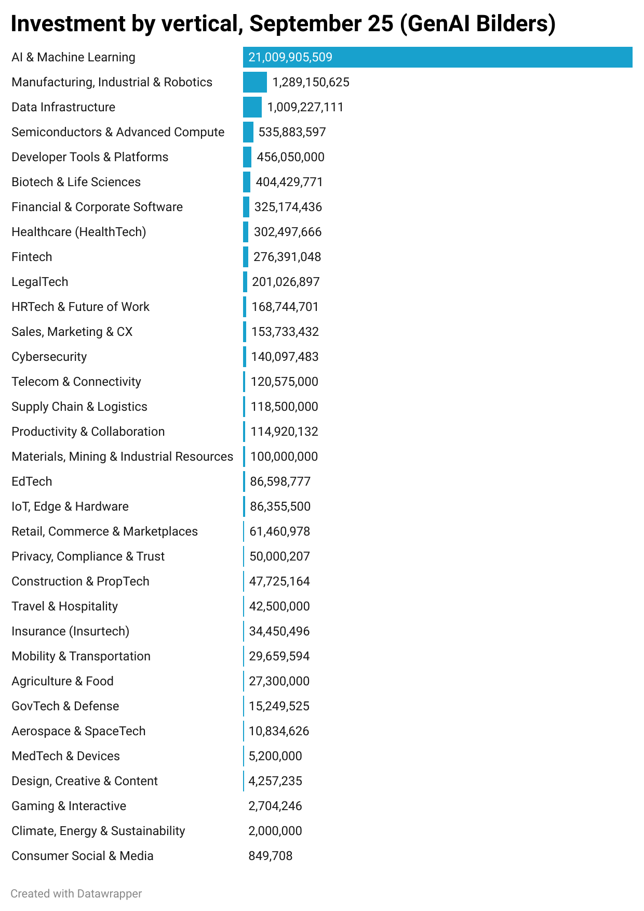

### AI Investment Trends & Builder Patterns — September 25

*Originally posted in GenAI Builders Newsletter.*

After the slowest month since 2017, AI VC activity rebounded in September, recording the highest number of mega-deals and restoring momentum mostly to late-stage rounds.

*(We analysed 428 VC AI investments >$500k that happened in September.)*

**September’s Megarounds.** September saw an unprecedented cluster of mega-rounds flowing into model & AI Infra players (Anthropic, Mistral, Cohere, Perplexity and AI Platforms — Cerebras Systems, Groq, Cognition, Nscale, Baseten, Modular …). Early stage is tilting towards vertical agents focusing on document & automation use-cases in top GenAI verticals LegalTech, HRTech, Healthcare Ops, FinTech…

**Heterogeneous AI infrastructure fabrics.** Modular ($250M, Series C)’s inference stack lets you manage heterogeneous hardware (CPU+GPU — multiple vendors) clusters over a single API whereas Upscale AI ($100M, Seed) is providing the networking fabric for a unified AI networking fabric. Cerebras Systems & Groq keep carving out niches in vertical & sovereign AI clouds serving large LLMs with deterministic latency.

**Europe’s sovereign AI infrastructure.** Europe is building in its own way powered by renewables with Nscale ($1.1B, Series B) in the hyperscaler-for-AI gaming space and DataCrunch ($65M, Series A) offering a developer-first, self-serve AI GPU cloud. ASML became Mistral AI’s largest shareholder (≈11%) with a strategic board seat — a European sovereignty play across chips, compute & models.

**Agents are condensing in the earlier stages.** Mimica ($26.2M, Series B) has a unique task mining approach by watching how individuals complete work on their desktops, clustering organisation‑wide behavior and suggesting automation opportunities. Druid AI ($31M, Series C) is another horizontal agency player that plugs into legacy/RPA stacks (e.g., UiPath) and spans CX/EX.

**AI Science Factory PPPR rounds.** More ambitious startups with Lila Sciences ($235M, Series A, Drug Discovery), Periodic Labs ($300M, Seed, Advanced Materials), Cusp AI ($100M, Series A, Advanced Materials) lead the pack using generative models to propose candidates for physical experiments — shrinking the solution space for fringe scientific problems in molecular design, an increasingly active implementation pattern for GenAI. VCs are funnelling large funds to closed‑loop ‘AI science factories’ pre‑product, pre‑revenue (PPPR) rounds.

A similar startup is Hiverge ($5M, Seed), focusing on writing and improving optimisation algorithms with LLMs, created by DeepMind alumni behind AlphaFold and AlphaTensor.

**NVIDIA is going all‑in.** 22 deals in September alone, seeding every layer of the stack to both create and capture demand.

Figure 1 — Top investments, September 25

The month’s funding skewed heavily toward later‑stage rounds.

GenAI was most applicable in horizontal enablers (AI/ML platforms, Sales/CX, Productivity, DevTools) with LegalTech leading the regulated verticals, while FinTech/HealthTech sat mid-pack and capital-heavy or integration-burdened sectors (Semis, Biotech, Supply/Prop/Insure) lagged.

September AI/ML funding overwhelmingly concentrated in Foundation Models/LLMs (late-stage/PE heavy), with MLOps and agentic orchestration getting modest share, while RAG/LLMOps and the rest (multimodal, safety/evals, AutoML, synthetic data, edge) barely registered.

### AI Agent Plays

Among disclosed rounds, funding concentrated heavily in OpenAI/GPT and Meta/Llama (late-stage dominated) with Anthropic a distant third, while Cohere, Alibaba/Qwen, Google/Gemini, and xAI/Grok saw minimal disclosed capital — signaling continued consolidation around a few U.S. model leaders with a long thin tail.

Agent funding clustered around orchestration platforms and coding/support agents — the “control plane + developer productivity” bets — while voice saw niche traction and ops/back-office and sales/marketing agents lagged, signaling investor preference for platform leverage over narrow GTM bots.

### Conclusion

AI capital has been concentrating in early winners and infrastructure moats, shifting capital to later rounds starting in the second half of 2025. Pre‑seed/seed is still active but is highly selective with bigger early checks, high PPPR investments and slower Series‑A graduation. For early stage agent startups the bar is higher requiring solid traction for funding.

👉 If this was useful, follow my LinkedIn newsletter — [AI Builder Patterns](https://www.linkedin.com/build-relation/newsletter-follow?entityUrn=7267852565411737601) — for weekly, production-grade agent patterns.
