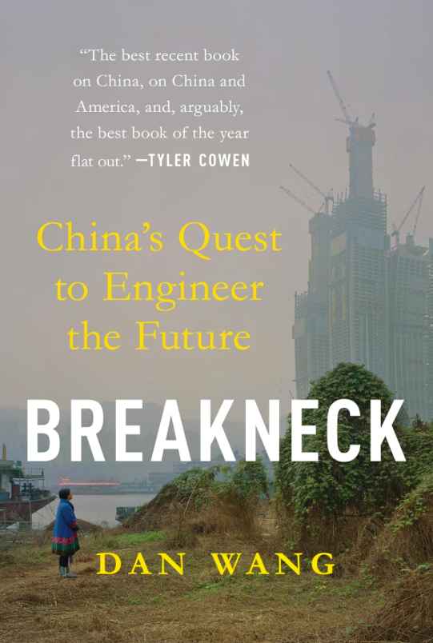

# [Breakneck - China's Querty to Engineer the Future](https://www.amazon.com/Breakneck-Chinas-Quest-Engineer-Future-ebook/dp/B0DXQGL4X9/)

_Published: September 11, 2025_ [Goodreads 4.3](https://www.goodreads.com/book/show/55625997-breakneck)

_Themes: Manufacturing · Process knowledge · Industrial policy · Supply chains · Governance_
 
{ width="360" style="border-radius:6px; box-shadow: var(--md-shadow-z2); display:block; margin: 0.5rem auto 1rem;" }

## Why it matters

When you move your manufacturing you move your whole learning system as well as  your innovation ecosystem along along with it which is very difficult to replicate or even rebuild it yourself.

## Key takeaways
- Process knowledge is tacit: it is transmitted through co‑location, apprenticeship, and supplier relationships—not PDFs.
- Production is a learning system: every build yields feedback; learning loops close fastest near the factory.
- Ecosystems beat individuals: clusters like Shenzhen create community standards, shared parts bins, and a culture of engineering practice.
- Who governs shapes what gets built: engineers optimize for making; lawyers optimize for rules; financiers optimize for returns.
- Completionism is a moat: end‑to‑end capability reduces dependency risk and increases bargaining power.
- Implication for builders in the West: put teams closer to production, invest in manufacturing literacy, and shorten the design‑to‑factory feedback loop.

## Notes
- When US companies offshored manufacturing to China, they didn’t just move factories—they exported tacit “process knowledge” that lives in people, supplier networks, and production routines, not just in blueprints.
- Dense manufacturing ecosystems (e.g., Shenzhen) compress iteration cycles and learning loops; proximity compounds capability.
- China’s state capacity is heavily influenced by engineers who prioritize tangible production over “financialization” and purely virtual markets.
- A strategy of “completionism” builds end‑to‑end, domestically contained supply chains, making industries sticky and resilient.
- In contrast, US institutional dominance by lawyers often adds procedural complexity and rent‑seeking, channeling power and resources upward while slowing real‑economy execution.
