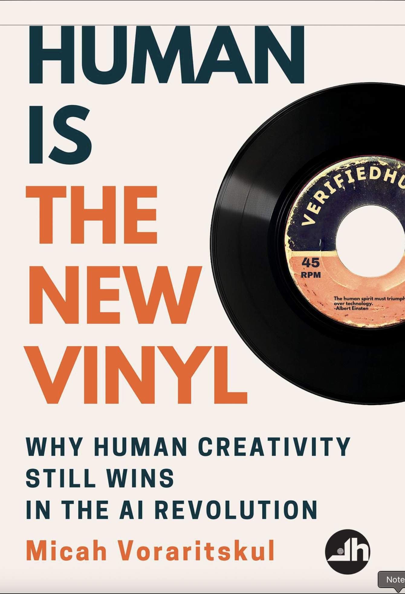

# Human is the New Vinyl

_Published: August 19, 2025_

_Themes: AI adoption · Human-centered design · Craft vs speed_

{ width="360" style="border-radius:6px; box-shadow: var(--md-shadow-z2); display:block; margin: 0.5rem auto 1rem;" }

## Why it matters
- What this book adds to your mental models.
- Where it challenges the common narratives.

## Key takeaways
- Point 1
- Point 2
- Point 3

## Notes
Add your highlights, quotes, and cross-links here.
