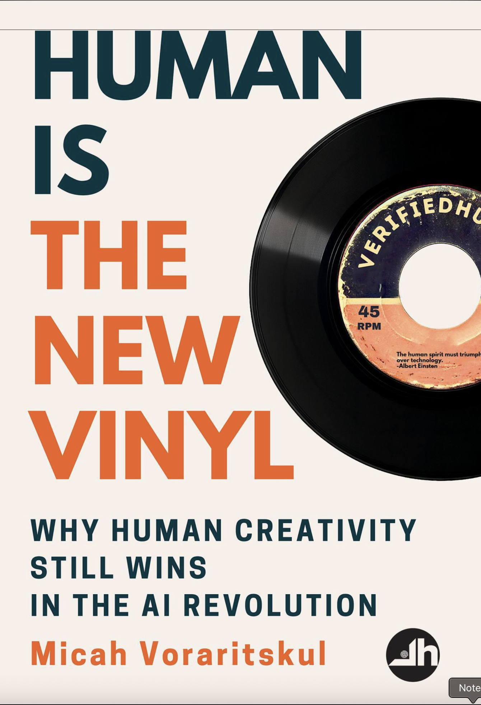

# Books

Short, opinionated notes on books I recommend, with “why it matters” takeaways and links.

_Add entries here as you publish them._

## Recent entries

 - { width="72" style="vertical-align:middle;margin-right:8px;border-radius:4px;" } [If Anyone Builds It, Everyone Dies](anyone-builds-everyone-dies.md) — <small>September 16, 2025</small>
 - { width="72" style="vertical-align:middle;margin-right:8px;border-radius:4px;" } [Breakneck](breakneck.md) — <small>September 11, 2025</small>
 - { width="72" style="vertical-align:middle;margin-right:8px;border-radius:4px;" } [Human is the New Vinyl](human-is-the-new-vinyl.md) — <small>August 19, 2025</small>
 - { width="72" style="vertical-align:middle;margin-right:8px;border-radius:4px;" } [The Cold Start Problem: How to Start and Scale Network Effects](the-cold-start-problem.md) — <small>December 7, 2021</small>
 - { width="72" style="vertical-align:middle;margin-right:8px;border-radius:4px;" } [The Design of Everyday Things](design-of-everyday-things.md) — <small>November 15, 2013</small>
 - { width="72" style="vertical-align:middle;margin-right:8px;border-radius:4px;" } [The Launch Pad](the-launch-pad.md) — <small>September 27, 2012</small>
