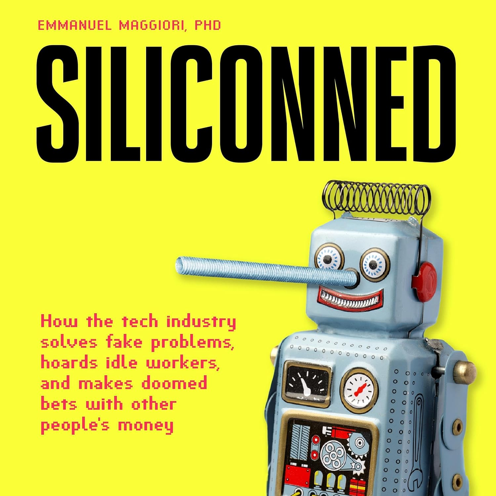

# [Siliconned: How the tech industry solves fake problems, hoards idle workers, and makes doomed bets with other people's money](https://www.amazon.com/Siliconned-Industry-Problems-Workers-Peoples/dp/B0DKKKXL83/ref=sr_1_1?crid=1XT2CGECIWZ60&dib=eyJ2IjoiMSJ9.-2sk2ZmR1BpVsOp5yDcECtYa-IjE50VIK_Ax49G4e7k.X9kC6B_MJDH0sZ6bCs59uRMZgTZ6TQXb8yLcFEIAsX0&dib_tag=se&keywords=Siliconned%3A+How+the+tech+industry+solves+fake+problems%2C+hoards+idle+workers%2C+and+makes+doomed+bets+with+other+people%27s+money&qid=1758393760&s=books&sprefix=siliconned+how+the+tech+industry+solves+fake+problems%2C+hoards+idle+workers%2C+and+makes+doomed+bets+with+other+people%27s+money%2Cstripbooks-intl-ship%2C208&sr=1-1)

_Published: July 22, 2024 — [Goodreads 4.32](https://www.goodreads.com/book/show/215041537-siliconned)_  
_Themes: Technology industry · Venture capital · Hype cycles · Incentives · Data privacy · Labor economics_
 
{ width="360" style="border-radius:6px; box-shadow: var(--md-shadow-z2); display:block; margin: 0.5rem auto 1rem;" }

## Why it matters

When capital is cheap and narratives dominate, the tech industry can chase fads, fund fake problems, and socialize risks while privatizing gains. Understanding the incentives behind hype helps founders and investors allocate attention—and capital—to real productivity instead of bubble logic.

## Key takeaways
- VC hype cycles: herd behavior, momentum funds, and cheap money amplify narratives over fundamentals; misallocation follows.
- Wrong bets get oxygen: attention and capital concentrate in trendy verticals (e.g., 2017–2022 crypto mania), crowding out less flashy but useful work.
- Fake‑problem product building: “solutionism” looks for markets to fit the tech; users become the product, or value props stay fuzzy.
- Idle headcount hoarding: large tech firms stockpile talent during booms, then shed en masse—destroying compounding product knowledge.
- Externalities borne by workers and users: gig workers absorb volatility; users pay in data privacy, manipulation, and surveillance harms.
- Data exploitation: platforms over‑collect and repurpose data; governance and incentives lag behind harms and scale effects.
- Fix the incentives: reward real unit economics, measurable productivity, and user value creation—not just narrative virality.

## Notes
- Your note: many VCs optimize for hype, hyping the wrong tech (e.g., crypto), misreading product‑market reality and ignoring negative externalities.
- Case studies (distilled from public reviews):
  - Uber drivers: volatile earnings, limited benefits; “platform empowerment” often masks shifted risk.
  - Facebook–Cambridge Analytica: data misuse illustrates privacy harms and the need for stronger guardrails.
- Structural drivers of bubbles: prolonged low interest rates, growth‑at‑all‑costs culture, and copycat capital form giant feedback loops.
- Better playbook: evaluate real problems, unit economics, and user value; resist solutionism; invest in privacy and safety from day one.
