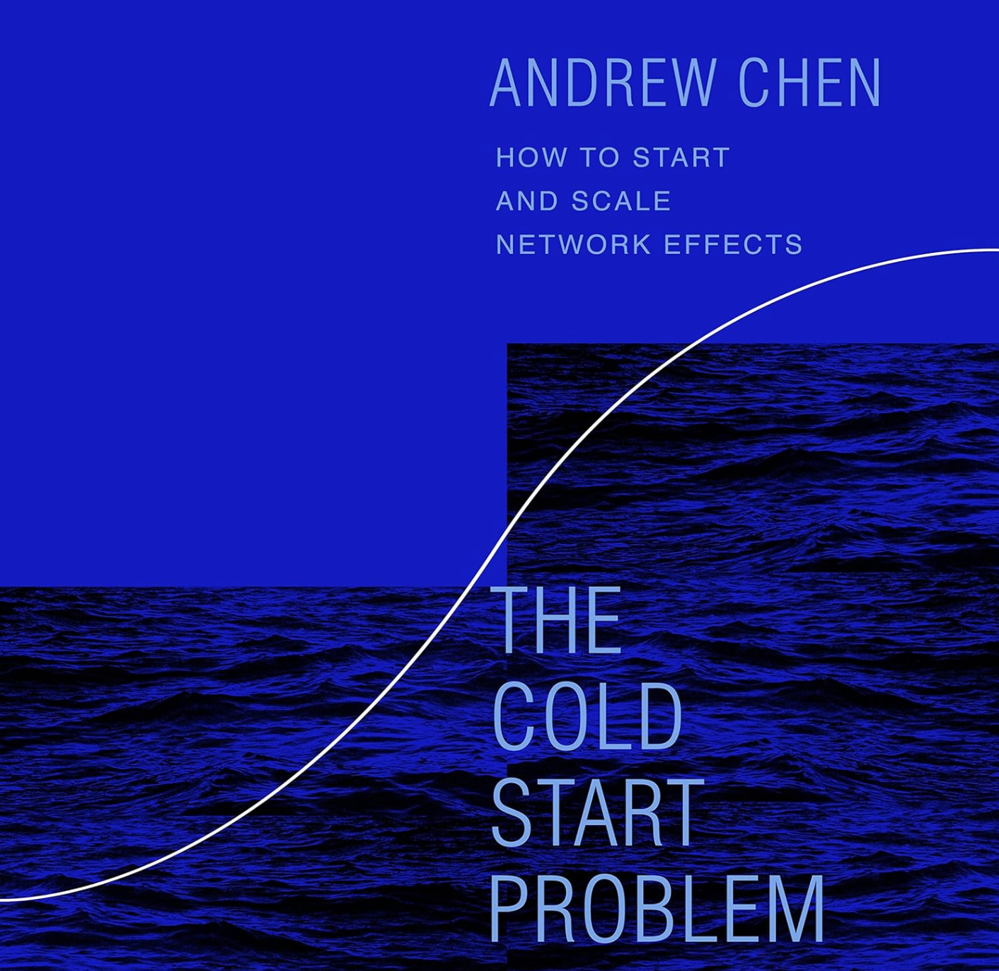

# [The Cold Start Problem: How to Start and Scale Network Effects](https://www.amazon.com/dp/0062969749)

_Published: December 7, 2021 — [Goodreads 4.19](https://www.goodreads.com/book/show/55338968-the-cold-start-problem)_  
_Themes: Network effects · Growth · Marketplaces · Moats · Startups · Platform strategy_
 
{ width="360" style="border-radius:6px; box-shadow: var(--md-shadow-z2); display:block; margin: 0.5rem auto 1rem;" }

## Why it matters

In today’s zero‑sum attention economy, cloning product features is cheap, but cloning a network is nearly impossible. Network effects drive nonlinear growth, defensibility, and lasting value—especially for consumer platforms and marketplaces. This book provides a pragmatic playbook for getting from zero users to escape velocity and then turning the network into a moat.

## Key takeaways
- Start with an atomic network: the smallest self‑sustaining unit where the product is valuable on its own (e.g., a city for Uber; a campus for Tinder).
- Identify and win the hard side: the scarce side that creates disproportionate value (e.g., drivers for Uber, highly attractive users for dating apps, power creators for Wikipedia).
- “Come for the tool, stay for the network”: seed with a single‑player tool (e.g., Instagram filters) that later converts to network participation.
- Subsidize early when needed: cash incentives, exclusive access, or founder‑led “flintstoning” to bootstrap liquidity and content.
- Replicate atomic networks to reach the tipping point: stitch together many healthy cells into a larger, momentum‑building network.
- Escape velocity levers:
  - Acquisition effects: viral loops, invites, waitlists, paid growth that lowers CAC.
  - Engagement effects: design interactions for the network (not just single‑player utility).
  - Economic effects: improve monetization and conversion with data as the network scales.
- Expect ceilings: fight parasites (spam/trolls), feed relevance via search/feeds/curation, and reduce friction.
- Build the moat: dominate niches, keep growing atomic networks, add product and economic lock‑in where possible.

## Notes
- Zero‑to‑one tactics often don’t scale—and that’s okay. Do things that don’t scale to recruit the hard side early (YC maxim).
- “Flintstoning”: founders act as the hard side—seed supply manually (e.g., Reddit founders posting first‑party content; console “first‑party” titles).
- Uber’s city‑by‑city launch playbook included cash incentives and PR stunts (e.g., Driver Zero) before scalable growth channels took over.
- Marketplaces and social platforms are defined by their networks; owning the network is the true defensibility.
- Attention is zero‑sum; once a network captures a market, displacement becomes very costly without a 10x wedge.

> Summarized from my original post on Cloud Atlas (Dec 31, 2022) with added structure and highlights.
