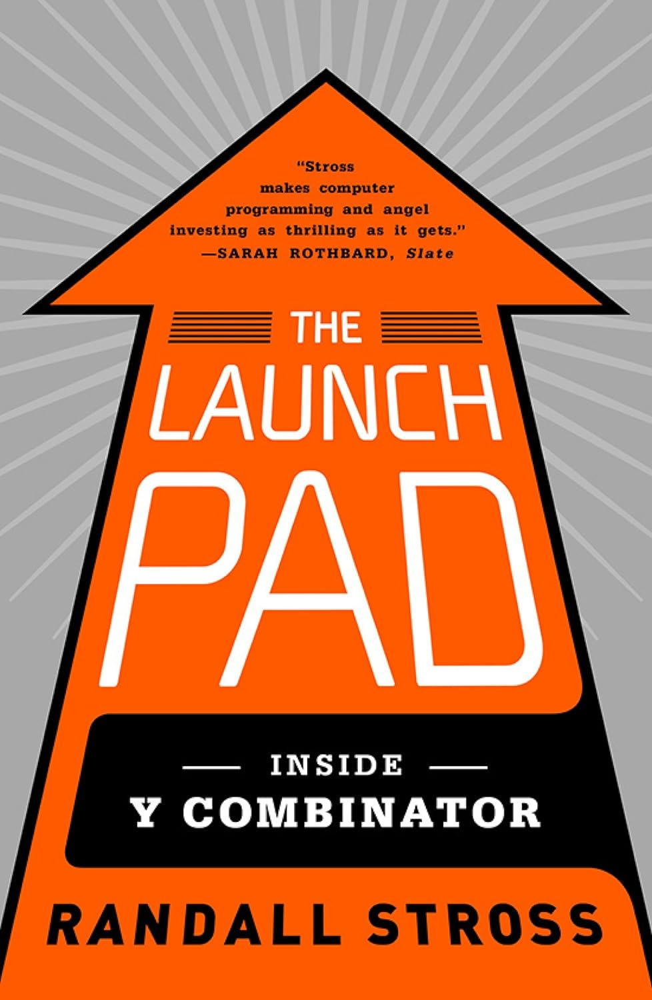

# [The Launch Pad: Inside Y Combinator, Silicon Valley's Most Exclusive School for Startups](https://www.amazon.com/Launch-Pad-Inside-Combinator-ebook/dp/B007X5ZBU4/ref=tmm_kin_swatch_0)

_Published: September 27, 2012 — [Goodreads 4.05](https://www.goodreads.com/book/show/13573052-the-launch-pad?from_search=true&from_srp=true&qid=4iFYdpfzAJ&rank=1)_  
_Themes: Startups · Y Combinator · Founder journeys · Fundraising · Product‑market fit · Lean startup_
 
{ width="360" style="border-radius:6px; box-shadow: var(--md-shadow-z2); display:block; margin: 0.5rem auto 1rem;" }

## Why it matters

An on‑the‑ground view of how YC shaped the modern startup playbook—what it selected for, how it coached, and the cultural norms and incentives that defined an industry template.

## Key takeaways
- YC is optimized for speed and focus: minimal formal curriculum, heavy peer pressure via weekly dinners and Demo Day milestones.
- PG’s “invest in founders, not ideas” philosophy—fund the pivot—front‑loads talent selection over initial concepts.
- Early capital via a standard note (e.g., Start Fund) trades breadth for certainty, placing small bets across the cohort to capture outliers.
- Emphasis on “hacker” teams: small, deeply technical, young, and intensely focused; low burn and “ramen profitability” extend runway.
- Launch fast and iterate: measure weekly, pivot quickly with real user feedback; do things that don’t scale.
- The ecosystem rewards “pick‑axes during gold rushes”—infrastructure and platform plays can be powerful businesses.

## Notes
- YC runs two 3‑month cohorts per year in Mountain View; founders self‑direct and leverage community over formal sessions.
- Office hours with PG emphasize narrative clarity for investors and sharpening the core value proposition.
- Tactics: flintstoning, PR stunts, and unscalable early efforts are acceptable to spark initial momentum.
- Demo Day stories highlight emerging giants (Stripe, Dropbox, Codecademy) and PG’s pattern recognition.
- A vivid chronicle of the experiment that helped define how today’s startup ecosystem operates.
