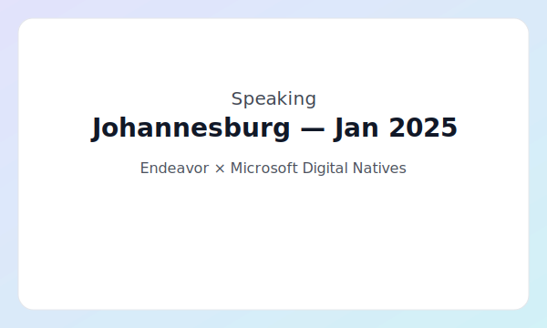

# Speaking

Talks, conference sessions, and workshops.

## Johannesburg — Jan 2025

Endeavor × Microsoft Digital Natives — keynote on Evolving GenAI Use Cases: Trends and Insights.

{ width=260 align=left loading=lazy }

Highlights

- Levels of capability: assistants → digital workforce → multi‑modal → advanced reasoning use‑cases.
- From RAG to GraphRAG to agentic patterns; when to use each.
- Evaluations, observability, and safety as core production disciplines.
- Practical takeaways for founders: build data feedback loops, memory, and tool use into your roadmap.

Details

- Date: January 2025
- Location: Johannesburg, South Africa
- Event: Endeavor × Microsoft Digital Natives
- Slides: coming soon
- Recording: —

