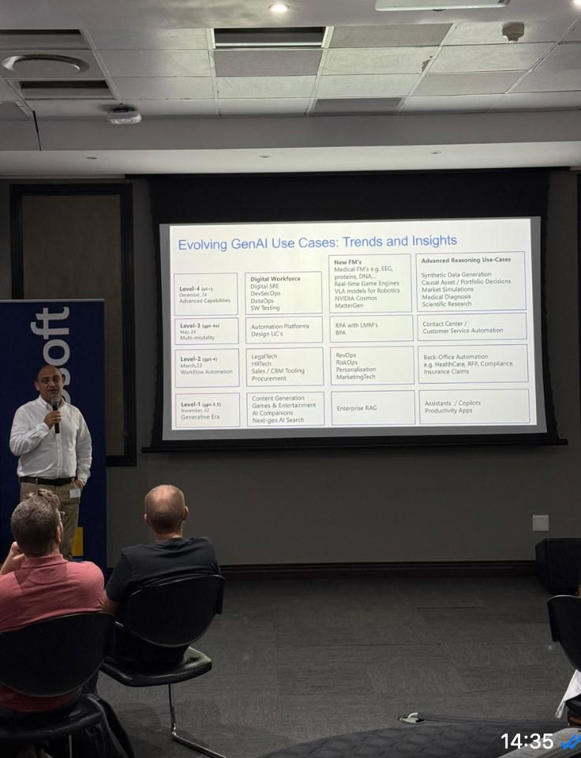

# Speaking

Talks & workshops on agentic AI, GraphRAG, AI UX, and EvalOps — practical playbooks for builders.

[Book a talk](/contact){ .subscribe-box target="_blank" rel="noopener" }
[Speaker one-pager](/assets/speaker-onepager.pdf){ .subscribe-box .subscribe-box--outline target="_blank" rel="noopener" }

## Upcoming & recent

  <!-- DUPLICATE this .talk-card per event -->
  

    
    <h3>Johannesburg — Jan 2025</h3>
    
Endeavor × Microsoft Digital Natives · Keynote · Johannesburg, South Africa

    

      Reasoning Models
      Graph 
      Agents
    

    

      
<strong>Highlights</strong>

      <ul>
        <li>Product-led AI engineering patterns for real-world apps.</li>
        <li>Designing agent workflows, tooluse, and memory.</li>
        <li>From prototype to production: evals and observability.</li>
      </ul>
    

    
  

  

    

    <h3>Istanbul — May 2025</h3>
    
DigitalZone Exclusive Talks · Workshop · Istanbul, Turkey

    

      Builder Patterns
      AI UX
      Agents
    

    

      
<strong>Highlights</strong>

      <ul>
        <li>Product-led AI engineering patterns for real-world apps.</li>
        <li>Designing agent workflows, tooluse, and memory.</li>
        <li>From prototype to production: evals and observability.</li>
      </ul>
    

    

      <a class="read" href="/contact">Request this talk</a>
    

  

